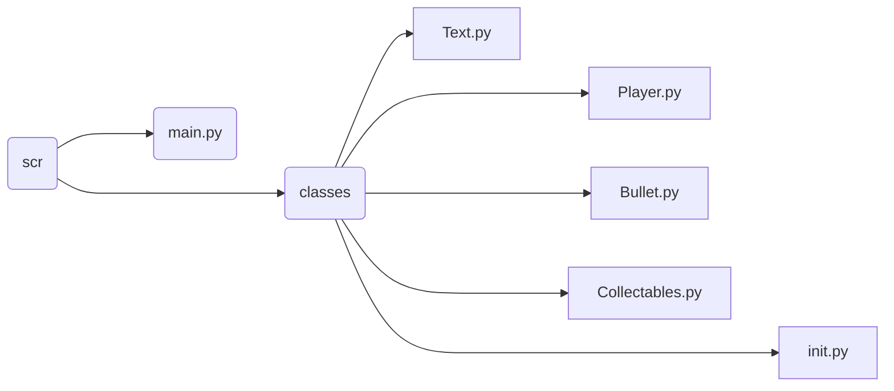

# Projeto P1 - Squareslinger

Esse projeto, mentorado pelos docentes Ricardo Massa e Sérgio Soares, faz parte da atividade de fechamento da disciplina de Programação 1 do curso Sistemas de Informação, semestre 2023.2, da UFPE — Universidade Federal de Pernambuco.

## Objetivo e Funcionalidades

Squareslinger é um jogo de multiplayer local de dois jogadores que possui o objetivo de acertar o outro jogador para vencer. Os jogadores podem se deslocar verticalmente pela tela utilizando as teclas: W (cima), S (baixo) para o jogador 1 e ↑ (cima), ↓ (baixo) para o jogador 2. Para acertar o adversário, o jogador terá à sua disposição um projétil que será acessado utilizando “D” (jogador 1) ou “←” (jogador 2), o projétil poderá ser disparado em um ângulo de 90 ou 180 graus. Os jogadores podem acertar também os itens coletáveis no mapa para conseguir power-ups, como: aumentar a velocidade do jogador, aumentar a velocidade do projétil e aumentar a taxa de disparo.

## Instruções

Para utilizar o jogo, siga as instruções abaixo:

- Instale a linguagem python.
- Clone este repositório com o seguinte comando: `git clone https://github.com/mateusriff/python_oop_game.git`
- Baixe o pygame utilizando: `pip install pygame`
- Acesse a pasta `src` e execute o arquivo `main.py`

## Integrantes e suas funções

| INTEGRANTE |FUNÇÃO |
-------------------|-----------------------------|
`Breno Augusto` |Criação da classe dos personagens|
`Clara Costa` |Criação da renderização de texto, trabalhou no relatório e nos slides |
`Luiza Cavalcante `| Criação da classe de coletáveis
`Mateus Riff ` |Fez o projeto base, dividiu as tarefas e organizou o projeto|
`Pedro Augusto ` |Criação dos projéteis, trabalhou no relatório e nos slides|
`Rafael Sales ` | Criação da classe de texto animado 

## Ferramentas e Métodos de Organização

Escolhemos utilizar a linguagem de programação Python para criar o jogo, juntamente com as plataformas Visual Studio Code e Pycharm para a edição de código. Em relação às bibliotecas, utilizamos o Pygame devido à sua oferta de recursos para facilitar a manipulação de sistemas interativos em ambiente 2D e ampla documentação online. Para um maior compartilhamento de informações e, consequentemente, a distribuição de tarefas entre os integrantes utilizamos o GitHub. Com o intuito de melhorar a comunicação entre os integrantes, utilizamos como ferramentas para tal: Whatsapp, Google Meet e Discord.

## Conceitos Utilizados

Utilizamos alguns conceitos abordados nas aulas de Programação 1, como: condicionais, estruturas de repetição, funções, listas, tuplas, além de conceitos de Programação Orientada a Objetos (POO) para modularizar melhor o código.

## Desafios e erros enfrentados durante o projeto

Quando iniciamos o processo de desenvolver esse projeto nos deparamos com vários desafios, como: o aprendizado em relação a compreensão da Programação Orientada a Objetos (POO), além do uso de Git, GitHub e Pygame. A principal dificuldade da equipe estava em absorver novos conhecimentos a aplicá-los. Depois precisamos idealizar a ideia principal do jogo, o que demorou um pouco até decidirmos, de fato, o que iríamos trazer de funcionalidades. Tivemos o desafio, também, de conseguir conciliar o desenvolvimento do projeto com as demais disciplinas, pois houveram limitações em relação ao tempo e à disponibilidade.

Um dos grandes erros que enfrentamos como equipe foi a falta de uma comunicação eficaz que permitisse uma melhor colaboração para avançar nos requisitos básicos do projeto. Não imaginávamos o quão difícil seria trabalhar em grupo. Houveram problemas de redundância no código e, por esse motivo, ocorreram alguns bugs relacionados à integração de cada tarefa designada aos integrantes no momento de implementação ao loop principal do sistema interativo.

Ao identificar os problemas que estávamos tendo, buscamos solucionar através de encontros no Meet, na tentativa de identificar possíveis obstáculos no código e, a partir da análise desses erros, buscar uma ajuda coletiva para solucioná-los, melhorando, assim, nossa capacidade de trabalhar em equipe. Desse modo, percebemos o nível de importância de uma comunicação eficaz para a finalização do nosso projeto.

## Estruturação do código

---
`main.py`
>Arquivo principal do jogo

`\classes`
>Pasta com todas as classes criadas

`init.py`
>Arquivo para importar as classes

`Game.py`
>Classe de inicialização do jogo

`Player.py`
>Classe que representa os jogadores e as principais funcionalidades como: movimentação, disparo do projétil e coleta de power-ups.

`Bullet.py`
>Classe do projétil que pode ser disparado pelo jogador ou adversário

`Collectables.py`
>Classe dos elementos coletáveis

`Text.py`
>Classe de renderização do texto e classe FadingText, que herda de Text e causa o efeito de *fade-out*

## Capturas de Tela

---

---

